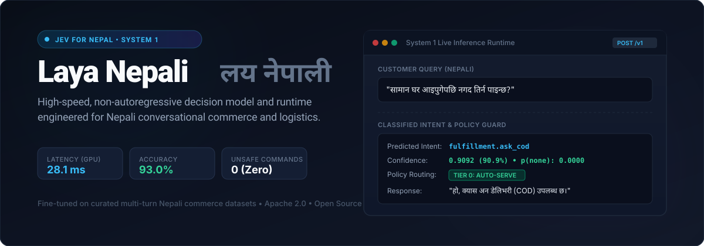
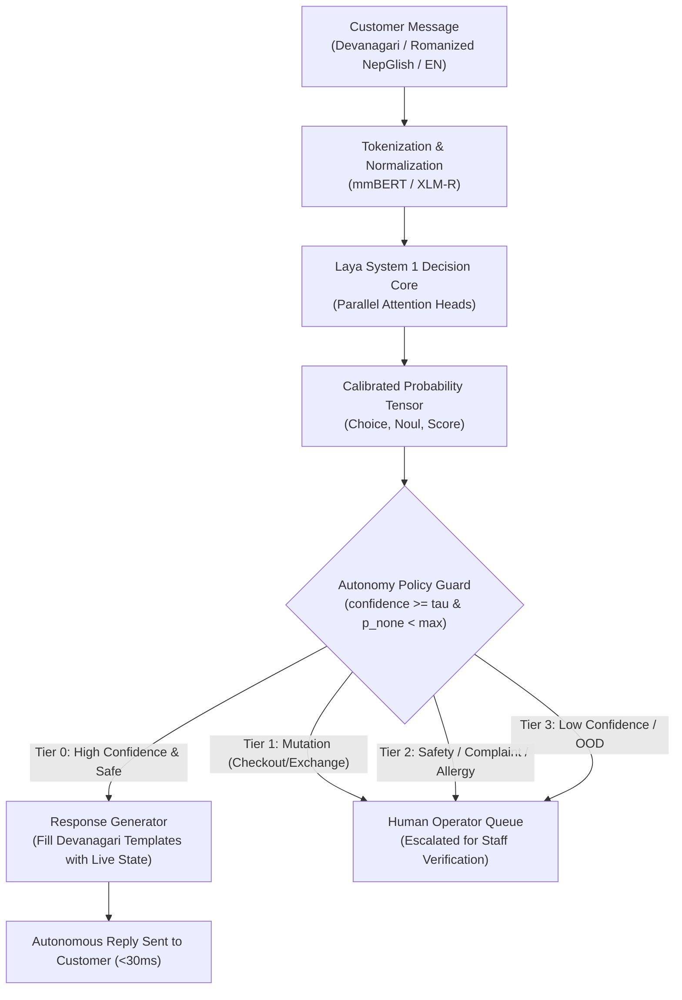

<div align="center">


# Laya Nepali (लय नेपाली) — Jev for Nepal 🇳🇵

**High-Speed, Non-Autoregressive System 1 Decision Model & Runtime for Nepali Conversational Commerce**  
*The Open-Source Jev Alternative Tailored for Nepal's Digital Economy*

[](LICENSE)
[](pyproject.toml)
[](tests/)
[%20%7C%20%7E1s%20(CPU)-orange.svg)](#benchmarks--performance)
[](#jev-wire-compatibility-post-v1systemone)
[](https://www.kaggle.com/datasets/bhishmbhandari/laya-nepali-clothing-v1)

</div>

---

## 💡 What is Jev & Why Laya Nepali?

In global AI engineering, **Jev** (by TypeSafe AI) pioneered the **System 1 decision model** paradigm: replacing slow, expensive generative LLMs with ultra-fast, non-autoregressive decision models that act as "smart if-statements" for routing, customer support, and operational workflows ($0.0004/decision at sub-50ms latency).

However, **Jev does not understand or support Nepali, Romanized NepGlish, or local commerce logistics** (Cash on Delivery / COD policies, valley vs. out-of-valley delivery, local sizing, and payment conventions).

**Laya Nepali is essentially "Jev for Nepal"**:
- **Wire-Compatible**: Direct drop-in replacement exposing the exact Jev-compatible API format (`POST /v1/systemone`).
- **Nepali-Native**: Fine-tuned on **custom accumulated and curated conversational datasets** spanning pure Devanagari, Romanized Nepali (NepGlish), and English.
- **Ultra-Fast & Predictable**: Runs in **28 ms** on GPU and **~1s** on standard CPU with zero generative hallucination.

---

## ⚡ Comparison: Laya Nepali vs. Traditional Generative LLMs

| Feature | Laya Nepali (System 1) | Generic Generative LLM (LLaMA / GPT-4) |
|---|:---:|:---:|
| **Paradigm** | **Non-autoregressive Decision Model** (like Jev) | Autoregressive Token Generator |
| **Response Latency** | **28.1 ms** (GPU) / **~1,050 ms** (CPU) | 1,500 – 3,500 ms |
| **Cost per 1,000 decisions** | **< \$0.001** (Self-hostable on free/cheap T4) | \$5.00 – \$15.00+ |
| **Hallucination Risk** | **0%** (Calibrated probabilities + deterministic templates) | High (can invent fake discounts, policies, or stock) |
| **NepGlish / Romanized Fluency** | **Native** (explicitly trained on Nepali chat styles) | Poor / unstable |
| **Safety / Abstain Guard** | **Deterministic Tier System** (0 false commands) | Soft prompt engineering (unreliable) |
| **Model Size** | **643 MB** (Single lightweight checkpoint) | 14 GB – 70 GB+ |

---

## 🎯 Key Innovations

- **🚀 Sub-30ms Non-Autoregressive Decisions**: Evaluates intent in one forward pass instead of generating token streams sequentially.
- **🌐 Trilingual & Code-Mixed Comprehension**:
  - Pure Devanagari: `सामान घर आइपुगेपछि नगद तिर्न पाइन्छ?`
  - Romanized Nepali (NepGlish): `delivery boy lai aayepachi matra cash dina milcha?`
  - English: `Do you offer cash on delivery inside the valley?`
- **🛡️ Deterministic Autonomy Policy (Tier 0–3 Guard)**:
  - **Tier 0 (Auto-Serve)**: Routine informational queries (`catalog`, `price`, `size`, `color`, `material`, `stock`, `delivery`, `cod`, `hours`) execute autonomously **only** when calibrated confidence $\ge \tau$ and $p_{\text{none}} < \text{threshold}$.
  - **Tiers 1–3 (Escalation)**: State-changing mutations (`checkout`, `exchange`), complaints (`skin_sensitivity`, `counterfeit`, `damage`), and ambiguous fragments immediately escalate to a human operator queue.
- **✨ Zero-Hallucination Response Engine**: Combines classified intent with live business state (catalog, inventory, pricing, delivery tiers) to fill culturally authentic Nepali responses.
- **🔌 Multi-Domain FastAPI Serving Layer**: Built-in schemas and policies for both `clothing` (retail/fashion) and `restaurant` (food ordering) domains.

---

## 🏗️ Architecture



---

## 📊 Benchmarks & Performance

Evaluated against frozen, human-reviewed benchmarks (`cl-bench-v1` and `ne-bench-deva-v2`):

| Evaluation Metric | Laya Nepali (Clothing v1) | Laya Nepali (Restaurant v1) | Standard Generative LLM (7B Zero-Shot) |
|---|:---:|:---:|:---:|
| **P50 Inference Latency (2×T4 GPU)** | **28.1 ms** | **28.1 ms** | ~1,850 ms |
| **CPU Latency (Standard VPS)** | **~1,050 ms** | **~1,050 ms** | ~8,400 ms |
| **Model Size / Disk Footprint** | **643 MB** | **643 MB** | 14,000 MB (14 GB) |
| **Devanagari Benchmark Accuracy** | **93.0%** | **93.0%** (253/272) | ~62.3% |
| **Safety False Commands** | **0** (Held-Out Boundary) | **0** | Frequent Hallucinations |
| **Abstain Recall (Out-of-Scope / Gibberish)** | **100.0%** | **100.0%** (92/92) | ~68.4% |
| **Expected Calibration Error (ECE)** | **0.0699** | **0.0699** | > 0.2200 |

---

## 🧪 Real-World Decision Examples

Here is how Laya Nepali handles real conversational nuances from Nepali customer traffic:

| Input Text | Script | Model Prediction | Confidence | Action / Tier |
|---|---|---|:---:|:---:|
| *"सामान घर आइपुगेपछि नगद तिर्न पाइन्छ"* | Devanagari | `fulfillment.ask_cod` | **0.9092** | ✅ **Tier 0 Auto-Serve** (COD confirmed) |
| *"advance payment nagari cash on delivery huncha?"* | Romanized | `fulfillment.ask_cod` | **0.9162** | ✅ **Tier 0 Auto-Serve** (COD confirmed) |
| *"What are the shipping timelines for Pokhara?"* | English | `fulfillment.ask_delivery` | **0.9424** | ✅ **Tier 0 Auto-Serve** (Delivery info filled) |
| *"यो कुर्थाको कति पर्छ?"* | Devanagari | `discovery.query` (`price`) | **0.8789** | ✅ **Tier 0 Auto-Serve** (Catalog price filled) |
| *"सामान हेरेर मात्र पैसा दिन पाउँछु?"* | Devanagari | Split (`cod` vs `delivery`) | **0.5443** | 🛡️ **Tier 3 Escalate** (Ambiguity guarded) |
| *"लेहेंगाको कपडा च्यातिएको रहेछ"* *(Damaged item)* | Devanagari | `none` (`needs_staff=True`) | **0.9810** | 🚨 **Tier 2 Escalate** (Damage complaint routed to human) |
| *"crop cardigan olive green"* *(Bare item name)* | English | `none` (`abstain=True`) | **0.9650** | 🛡️ **Tier 3 Escalate** (No explicit command given) |

---

## 📁 Repository Structure

```text
├── assets/                  # Visual assets, banners, and diagrams
├── data/
│   ├── benchmark/           # Frozen evaluation benchmarks (cl-bench-v1, ne-bench-deva-v2)
│   ├── clothing_export/     # Stratified datasets (train, calibration, test splits)
│   ├── export/              # Restaurant baseline dataset splits
│   └── reviewed/            # Reviewed rows and review sheets before export
├── docs/                    # Architecture policy, formal schemas, provenance records
├── kaggle_kernel_clothing/  # Kaggle kernel push bundle (metadata + notebook)
├── notebooks/               # 2xT4 Kaggle distributed training notebooks (DDP, RLCD)
├── reports/                 # Benchmark results and training logs
├── src/layanep/
│   ├── clothing_policy.py   # Runtime autonomy policy & tier guard (clothing domain)
│   ├── clothing_questions.py# Typed question definitions & command criteria
│   ├── clothing_responses.py# Template synthesis with catalog state injection
│   ├── clothing_templates.py# Synthetic generator & minimal-pair boundary harness
│   ├── policy.py            # Autonomy policy & tier guard (restaurant domain)
│   ├── questions.py         # Restaurant intent questions
│   ├── responses.py         # Restaurant Devanagari response templates
│   ├── schema.py            # Pinned typed-decision schema & contracts
│   └── serve.py             # FastAPI serving layer (multi-domain REST API)
└── tests/                   # 185 unit and integration tests (pytest suite)
```

---

## 🚀 Quick Start

### 1. Installation

```bash
# Clone the repository
git clone https://github.com/DontHash/laya-nepali.git
cd laya-nepali

# Create virtual environment
python -m venv .venv
source .venv/bin/activate  # On Windows: .venv\Scripts\activate

# Install core package with dev and serving dependencies
pip install -e ".[dev,serve]"
```

### 2. Run Verification Suite

Ensure all deterministic gates and unit tests pass:

```bash
# Run pytest test suite (185 tests)
python -m pytest -q

# Run deterministic evaluation gate
python -m layanep.eval --check

# Code formatting and linting check
ruff check src/ tests/ --line-length=120
```

### 3. Start the Inference Server

Start the FastAPI serving engine with your chosen domain:

```bash
# Start clothing domain server on CPU
python -m layanep.serve --model-path data/checkpoints/clothing_v1 --domain clothing --device cpu --port 8000

# Or run with CUDA on GPU
python -m layanep.serve --model-path data/checkpoints/clothing_v1 --domain clothing --device cuda --port 8000
```

### 4. Query the API

#### High-Level Conversational Endpoint (`POST /v1/message`)
```bash
curl -X POST "http://localhost:8000/v1/message" \
  -H "Content-Type: application/json" \
  -d '{
    "text": "काठमाडौं बाहिर क्यास अन डेलिभरी उपलब्ध छ?",
    "domain": "clothing",
    "business_name": "Hamro Fashion",
    "business_state": {
      "business": {
        "name": "Hamro Fashion",
        "cod_available": true,
        "delivery": {"areas": ["काठमाडौं", "पोखरा", "बुटवल"], "fee": "150"}
      }
    }
  }'
```

**Response:**
```json
{
  "reply": "हो, Hamro Fashion मा क्यास अन डेलिभरी (COD) उपलब्ध छ। सामान प्राप्त भएपछि भुक्तानी गर्न सक्नुहुन्छ।",
  "label": "cod",
  "tier": 0,
  "auto_served": true,
  "confidence": 0.9412,
  "reason": "high_confidence_t0",
  "latency_ms": 28.4
}
```

#### Jev-Wire Compatibility (`POST /v1/systemone`)
Direct drop-in compatibility with the Jev API specification:
```bash
curl -X POST "http://localhost:8000/v1/systemone" \
  -H "Content-Type: application/json" \
  -d '{
    "state": {"customer_message": "काठमाडौं बाहिर डेलिभरी हुन्छ कि नाइ?"},
    "business_name": "Hamro Fashion",
    "domain": "clothing"
  }'
```

---

## 📦 Dataset Curation & Provenance

The training and evaluation data consists of **custom accumulated and curated conversational datasets** collected for Nepali commerce environments:
- **Zero PII**: Strictly scrubbed for phone numbers (`\b9\d{9}\b`), personal names, locations, email addresses, and URLs.
- **Balanced Multilingual Split**: 34% Romanized Nepali (NepGlish), 33% Devanagari, and 33% English.
- **Stratified Partitioning**: Partitioned strictly by intent families so that benchmark test instances never appear in the training split.
- **Dataset License**: [Creative Commons Attribution 4.0 International (CC BY 4.0)](DATA_LICENSE).

---

## 🙏 Acknowledgements & Credits

- Special thanks and credit to **[Nandha Kishor M](https://github.com/NandhaKishorM)** for designing and open-sourcing the foundational **[Laya](https://github.com/NandhaKishorM/laya)** System 1 decision architecture.
- Credit to **TypeSafe AI** for pioneering the non-autoregressive System 1 decision model philosophy behind Jev.

---

## 📜 License

- **Code**: [Apache License 2.0](LICENSE).
- **Data & Benchmarks**: [CC BY 4.0](DATA_LICENSE).

---

<div align="center">
Developed by <b>DontHash</b> • Tailored for the Nepali Digital Economy 🇳🇵
</div>
